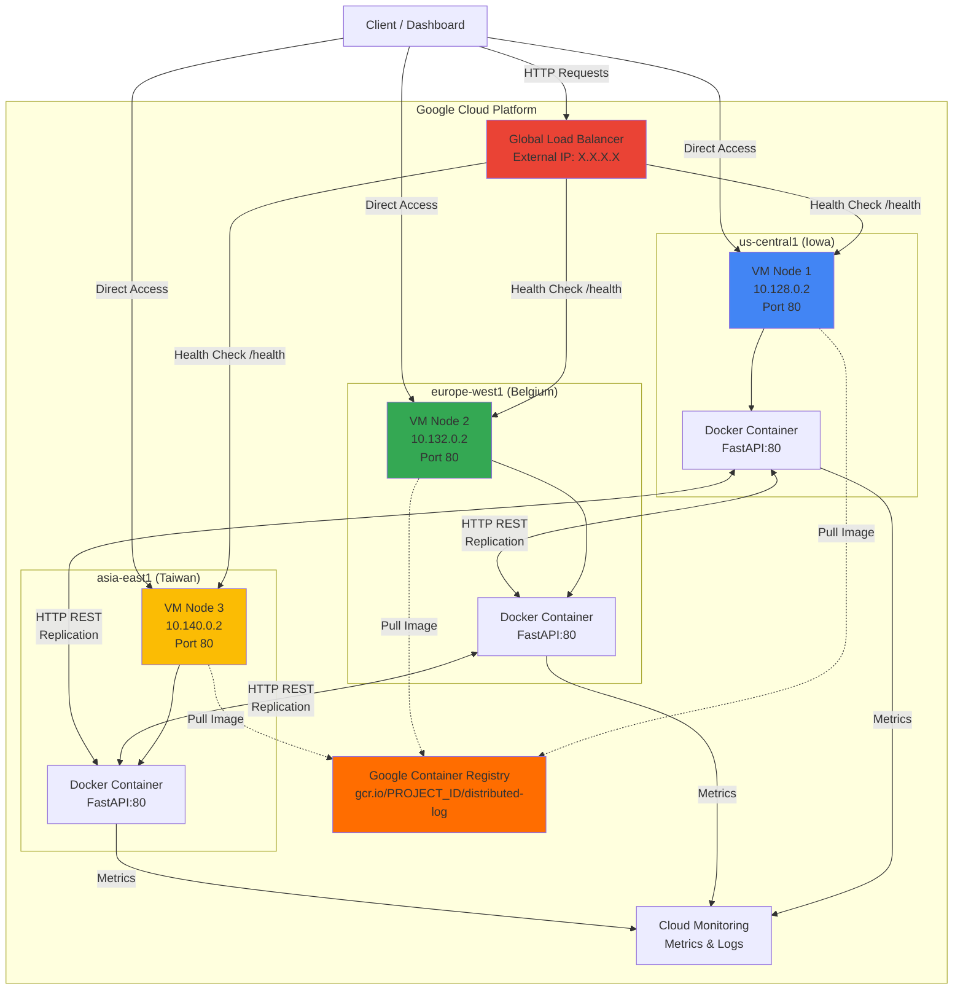
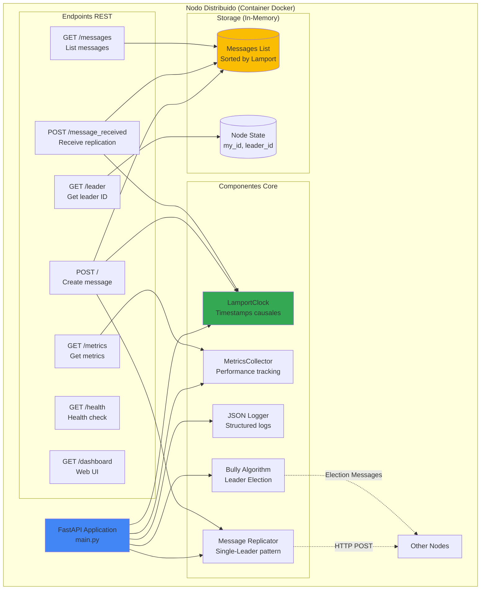
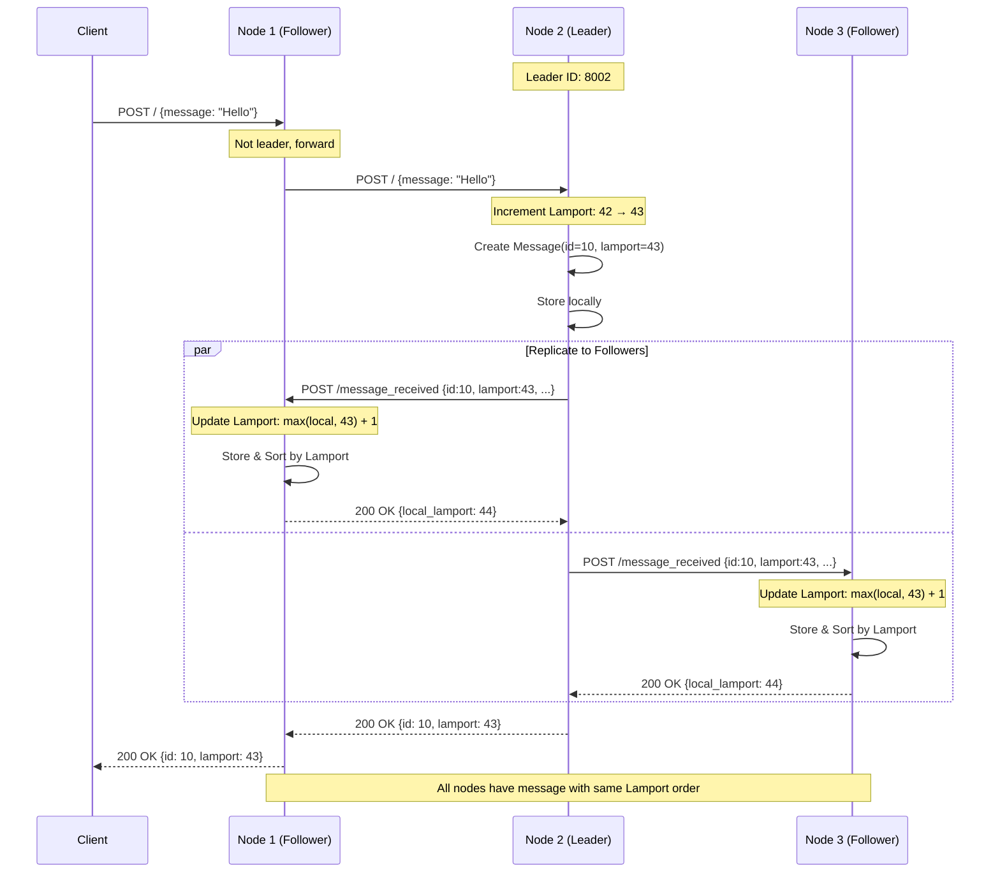
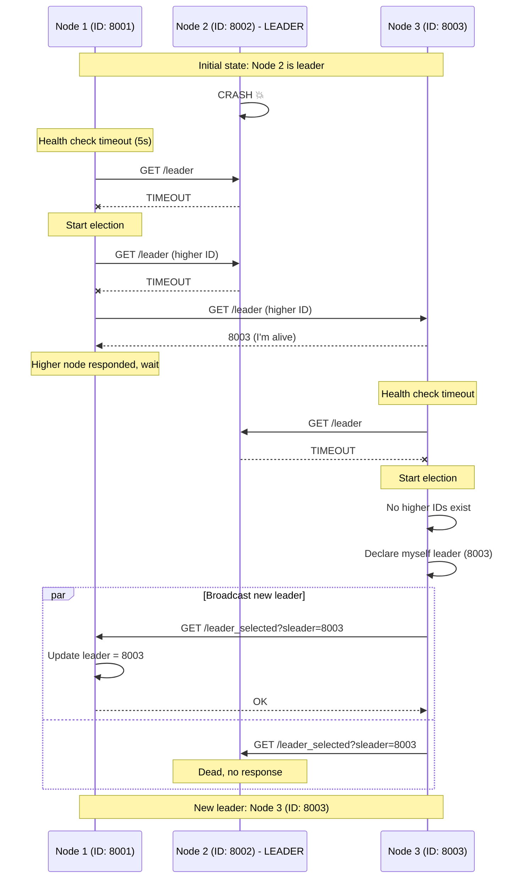
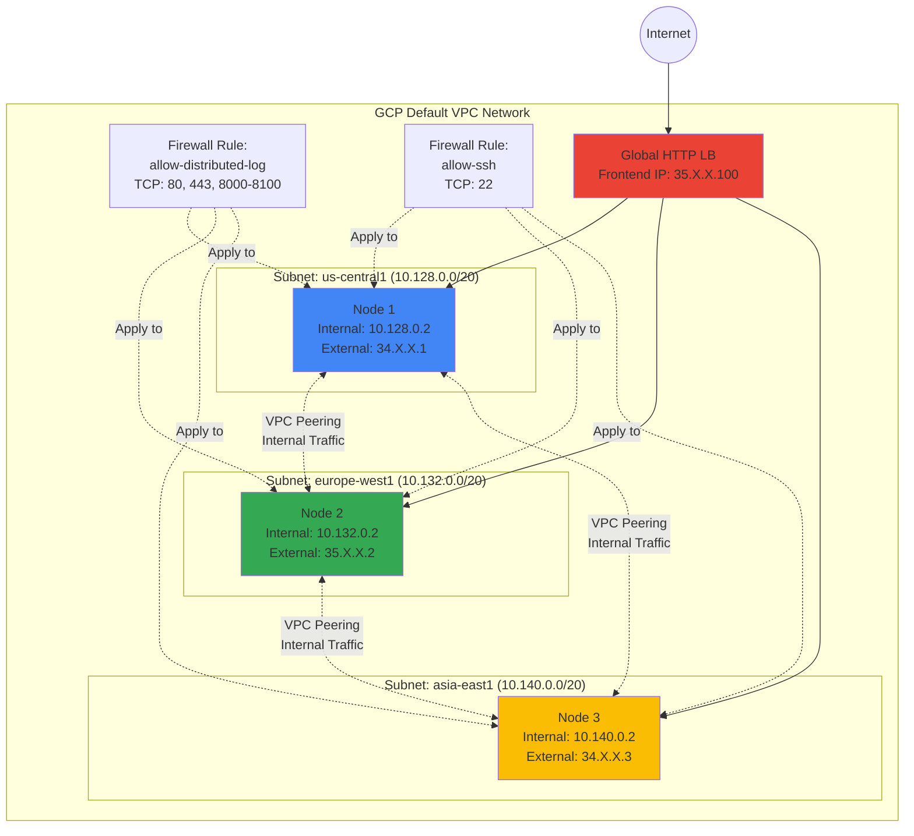

# 🎯 PLAN DETALLADO COMPLETO - Proyecto Sistemas Distribuidos

## Sistema: Log/Mensajería Distribuido con Ordenación Causal y Elección de Líder

---

## 📊 RESUMEN EJECUTIVO

### ¿Qué es este sistema? (Explicación para cualquier persona)

Imagina que tienes un **chat grupal** donde varias personas pueden enviar mensajes al mismo tiempo desde diferentes lugares del mundo. El problema es: **¿cómo garantizamos que todos vean los mensajes en el mismo orden?**

**El Problema:**
- Juan en México envía: "Hola"
- María en España envía: "¿Cómo están?"
- Pedro en Japón envía: "Buenos días"

Si no hay coordinación, cada persona podría ver los mensajes en orden diferente:
- Juan ve: Hola → Buenos días → ¿Cómo están?
- María ve: ¿Cómo están? → Hola → Buenos días
- Pedro ve: Buenos días → Hola → ¿Cómo están?

**Esto es un DESASTRE** en sistemas distribuidos porque:
- Una conversación pierde sentido
- Un sistema bancario podría procesar transacciones en orden incorrecto
- Un sistema de logs podría registrar eventos fuera de secuencia

**Nuestra Solución:**

Este proyecto implementa un **sistema de log distribuido** que garantiza que todos los nodos (servidores) vean los mensajes en el MISMO orden, incluso si están en diferentes países y la red tiene retrasos.

**¿Cómo lo logramos?**

1. **Reloj Lógico de Lamport:**
   - Cada mensaje recibe un "número de orden" (timestamp)
   - NO usamos la hora del reloj (que puede estar desincronizada)
   - Usamos un contador lógico que SIEMPRE crece
   - Ejemplo: mensaje 1 → timestamp 10, mensaje 2 → timestamp 11, etc.

2. **Algoritmo Bully (Elección de Líder):**
   - Uno de los servidores es el "líder" que coordina todo
   - Si el líder se cae, automáticamente se elige un nuevo líder
   - El servidor con el ID más alto siempre es elegido
   - Ejemplo: Si hay servidores 1, 2, 3 y el líder 3 cae → el servidor 2 se vuelve líder

3. **Replicación:**
   - Cuando el líder recibe un mensaje, lo envía a TODOS los demás servidores
   - Todos los servidores guardan el mismo mensaje con el mismo timestamp
   - Resultado: todos tienen la misma secuencia ordenada de mensajes

**En la Práctica:**

- Desplegamos 3 servidores en Google Cloud:
  - 1 en Estados Unidos (Iowa)
  - 1 en Europa (Bélgica)
  - 1 en Asia (Taiwan)

- Un usuario puede enviar un mensaje a CUALQUIER servidor
- El mensaje automáticamente se replica a todos
- Todos los servidores mantienen el mismo orden de mensajes
- Si un servidor falla, el sistema sigue funcionando con los otros 2

**Casos de Uso Reales:**

- **Chat distribuido:** WhatsApp, Telegram (millones de usuarios simultáneos)
- **Logs de aplicaciones:** Registrar eventos de múltiples servidores en orden
- **Sistemas bancarios:** Procesar transacciones en el orden correcto
- **Blockchains:** Ordenar transacciones de forma consistente

**Tecnologías Usadas:**
- Python con FastAPI (para crear la API REST)
- Docker (para empaquetar la aplicación)
- Google Cloud Platform (para desplegar en la nube)
- HTML/CSS/JavaScript (para el dashboard de monitoreo)

---

### Algoritmos a Implementar:
1. **Reloj Lógico de Lamport** - Ordenación causal de mensajes
2. **Algoritmo Bully** - Elección de líder (ya implementado, mejorar)
3. **Replicación Single-Leader** - Propagación de logs

### Stack Tecnológico:
- **Backend:** FastAPI + Python 3.9
- **Comunicación:** HTTP/REST + gRPC (opcional)
- **Containerización:** Docker
- **Cloud:** Google Cloud Platform (3 VMs en 3 regiones)
- **Monitoreo:** Cloud Monitoring + Dashboard Web custom

### Entregables:
- ✅ Código fuente con instrucciones
- ✅ Relatório IEEE (máx 6 páginas)
- ✅ Video 5 minutos
- ✅ Dashboard web en tiempo real

---

# 📐 ARQUITECTURA DEL SISTEMA

## Diagrama General de Arquitectura



### Explicación de la Arquitectura:

**Capa de Infraestructura (GCP):**
- 3 VMs desplegadas en regiones geográficas diferentes para simular un sistema distribuido real
- Cada VM ejecuta un contenedor Docker independiente con la aplicación FastAPI
- Las VMs se comunican entre sí mediante sus IPs internas (red VPC de GCP)

**Capa de Aplicación:**
- Cada contenedor Docker ejecuta una instancia completa del sistema (FastAPI + Lamport + Bully)
- Los nodos se replican mensajes entre sí usando HTTP POST
- Un nodo actúa como líder y coordina la replicación

**Capa de Acceso:**
- Load Balancer global distribuye tráfico de clientes entre los 3 nodos
- Los clientes también pueden acceder directamente a cada nodo por su IP externa
- Dashboard web permite monitorear el estado de cada nodo en tiempo real

**Por qué esta arquitectura:**
1. **Separación geográfica:** Simula latencias reales de red distribuida (~100-250ms entre regiones)
2. **Tolerancia a falhas:** Si una región cae, las otras 2 pueden continuar operando
3. **Escalabilidad:** Fácil agregar más nodos en nuevas regiones
4. **Observabilidad:** Cloud Monitoring + Dashboard permiten debuggear problemas

---

## Diagrama de Componentes Internos de Cada Nodo



### Explicación de Componentes:

**FastAPI Application (main.py):**
- Punto de entrada de la aplicación
- Expone endpoints REST para recibir mensajes, consultar estado, etc.
- Coordina todos los componentes internos

**LamportClock:**
- Mantiene el timestamp lógico del nodo
- Se incrementa antes de cada evento local (envío de mensaje)
- Se actualiza al recibir mensajes: `max(local, remote) + 1`
- **Por qué es necesario:** Garantiza orden causal sin sincronización de relojes físicos

**MetricsCollector:**
- Rastrea estadísticas: mensajes enviados/recibidos, latencias, violaciones causales
- **Por qué es necesario:** Para validar que el sistema funciona correctamente y generar datos para el relatório

**Bully Algorithm:**
- Detecta cuando el líder cae (timeout en health check)
- Inicia elección preguntando a nodos con ID mayor
- Se declara líder si ningún nodo mayor responde
- **Por qué es necesario:** Garantiza que siempre hay un líder para coordinar la replicación

**Message Replicator:**
- El líder replica mensajes a todos los followers
- Incluye timestamp Lamport en cada mensaje
- **Por qué es necesario:** Garantiza que todos los nodos tienen la misma secuencia de mensajes

**Storage (In-Memory):**
- Messages: Lista ordenada por timestamp Lamport
- **Limitación:** Se pierde al reiniciar (para persistencia real, usar Cloud Storage)

---

## Flujo de Comunicación: Envío de Mensaje



### Explicación Paso a Paso:

1. **Cliente envía mensaje a cualquier nodo** (puede ser follower o líder)
   - El cliente NO necesita saber quién es el líder
   - Simplifica la lógica del cliente

2. **Si el nodo NO es líder, reenvía al líder**
   - El nodo conoce quién es el líder (variable `leader`)
   - Forward transparente para el cliente

3. **El líder incrementa su reloj Lamport**
   - **CRÍTICO:** Esto debe hacerse ANTES de crear el mensaje
   - Garantiza que cada mensaje tiene un timestamp único y creciente

4. **El líder crea el mensaje con el timestamp**
   - Message(id=10, lamport=43, node_id=8002, content="Hello")
   - El timestamp Lamport será el mismo en todos los nodos

5. **El líder replica EN PARALELO a todos los followers**
   - Usa `par` (parallel) en el diagrama
   - Importante para minimizar latencia de replicación

6. **Cada follower actualiza su reloj Lamport**
   - Regla: `lamport_time = max(local_time, remote_time) + 1`
   - Si follower tenía tiempo 30, ahora tendrá 44 (max(30, 43) + 1)

7. **Cada follower almacena el mensaje y lo ordena**
   - Ordenamiento por: `(lamport_timestamp, node_id)`
   - El `node_id` se usa para desempatar si dos mensajes tienen el mismo timestamp

8. **Resultado final: Todos los nodos tienen el mismo orden**
   - Gracias a Lamport, el orden causal está garantizado
   - Si mensaje A → mensaje B (causalidad), entonces Lamport(A) < Lamport(B)

---

## Flujo de Elección de Líder (Bully Algorithm)



### Explicación del Algoritmo Bully:

**1. Detección de Falla (Node 1):**
- Node 1 ejecuta health check cada 5 segundos: `GET /leader` al líder actual
- Si el líder NO responde (timeout), asume que cayó
- **Por qué 5 segundos:** Balance entre detección rápida y falsos positivos por lag de red

**2. Inicio de Elección (Node 1):**
- Node 1 pregunta a TODOS los nodos con ID mayor: `GET /leader`
- En este caso: Node 2 (muerto, no responde) y Node 3 (vivo, responde)
- **Lógica:** Si un nodo mayor está vivo, él debería ser el líder

**3. Node 3 Recibe Respuesta:**
- Node 1 recibió respuesta de Node 3 (ID 8003 > 8001)
- Node 1 ESPERA que Node 3 maneje la elección
- **Por qué esperar:** El nodo con mayor ID tiene prioridad

**4. Node 3 Ejecuta su Propia Elección:**
- Node 3 también detectó que el líder cayó (health check)
- Pregunta a nodos con ID mayor: NO HAY (Node 3 es el de mayor ID)
- **Decisión:** Node 3 se declara líder

**5. Broadcast del Nuevo Líder:**
- Node 3 notifica a TODOS los nodos: `GET /leader_selected?sleader=8003`
- Node 1 actualiza su variable `leader = 8003`
- Node 2 está muerto, no recibe la notificación (pero no importa)

**6. Sistema Operacional:**
- Nuevo líder: Node 3
- Tiempo de recuperación: ~8 segundos (5s timeout + 3s elección)

**Propiedades Garantizadas:**
- ✅ **Safety:** El nodo con mayor ID siempre será elegido líder
- ✅ **Liveness:** Si hay nodos vivos, eventualmente habrá un líder
- ❌ **Problema:** Durante la elección (3s), NO hay líder → sistema no acepta mensajes nuevos

---

## Topología de Red GCP



### Explicación de la Red:

**VPC Network (Virtual Private Cloud):**
- GCP crea automáticamente una red `default` con subnets en cada región
- Cada subnet tiene un rango de IPs privadas (10.X.0.0/20)
- **Por qué VPC:** Permite comunicación privada entre VMs sin salir a internet

**IPs Internas vs Externas:**
- **Interna (10.128.0.2):** Para comunicación entre nodos (replicación)
  - Más rápida (no sale de GCP)
  - Más barata (sin costo de egress a internet)
- **Externa (34.X.X.1):** Para acceso desde clientes/dashboard
  - Necesaria para testing desde tu máquina local

**Firewall Rules:**
- `allow-distributed-log`: Permite tráfico HTTP/HTTPS en puertos 80, 443, 8000-8100
  - Aplica a VMs con tag "distributed-log"
  - **Sin esto:** Las VMs no pueden comunicarse entre sí
- `allow-ssh`: Permite SSH (puerto 22) para debugging
  - **Importante:** Para hacer `gcloud compute ssh log-node-1`

**Load Balancer:**
- IP pública única (35.X.X.100) que distribuye tráfico entre las 3 VMs
- **Ventaja:** Cliente solo necesita saber una IP
- **Health Checks:** Verifica `/health` cada 10s, quita VMs muertas del pool

**Comunicación entre Nodos:**
- Los nodos usan IPs INTERNAS para replicarse (ej: Node 1 → 10.132.0.2)
- **Por qué:** Latencia más baja (20-50ms vs 100-250ms por internet)
- **Configuración:** En el código, los nodos deben conocer las IPs internas de los otros

---

# 🔧 CONFIGURACIÓN Y VARIABLES DE ENTORNO

(Continúa con el resto del contenido original...)

# FASE 1: CORE FUNCIONAL (4-5 horas)

## 1.1 Implementar Reloj Lógico de Lamport ⏱️

### Archivo Nuevo: `lamport_clock.py`

```python
import threading

class LamportClock:
    """
    Implementación del Reloj Lógico de Lamport
    Garantiza ordenación causal de eventos en sistemas distribuidos
    """
    def __init__(self):
        self.time = 0
        self.lock = threading.Lock()

    def increment(self) -> int:
        """
        Incrementa el reloj local antes de enviar un mensaje
        Returns: nuevo valor del reloj
        """
        with self.lock:
            self.time += 1
            return self.time

    def update(self, remote_time: int) -> int:
        """
        Actualiza el reloj al recibir un mensaje
        Regla: time = max(local_time, remote_time) + 1

        Args:
            remote_time: timestamp Lamport del mensaje recibido
        Returns: nuevo valor del reloj local
        """
        with self.lock:
            self.time = max(self.time, remote_time) + 1
            return self.time

    def get_time(self) -> int:
        """Retorna el tiempo actual sin modificarlo (para lecturas)"""
        with self.lock:
            return self.time
```

---

### Modificar: `main.py`

#### Paso 1: Imports y setup inicial

```python
# AGREGAR al inicio del archivo
from lamport_clock import LamportClock
from metrics import MetricsCollector
from logger import setup_logger
import logging

# AGREGAR después de my_id = None
lamport_clock = LamportClock()
metrics_collector = MetricsCollector()
logger = None  # Se inicializará cuando tengamos my_id
```

#### Paso 2: Modificar modelo Message

```python
class Message(BaseModel):
    id: int
    content: str
    lamport_timestamp: int        # NUEVO - timestamp Lamport
    node_id: int                  # NUEVO - ID del nodo origen
    physical_timestamp: float     # NUEVO - time.time() para debugging
```

#### Paso 3: Modificar endpoint POST / (líneas 57-84)

```python
@app.post("/")
async def post(message: str):
    """
    Endpoint para crear un nuevo mensaje

    Flujo:
    1. Incrementar reloj Lamport ANTES de crear mensaje
    2. Si no soy líder, reenviar al líder
    3. Crear mensaje con timestamp
    4. Replicar a todos los followers
    """
    global messages

    # PASO 1: Incrementar reloj Lamport
    lamport_time = lamport_clock.increment()

    # PASO 2: Verificar si soy líder
    if leader != my_id:
        leader_srv = leader_server()
        if leader_srv is None:
            logger.error("No leader available")
            return {"error": "No leader available"}, 503

        # Reenviar al líder
        url = f"{leader_srv.url()}/?message={message}"
        try:
            response = requests.post(url, json={"message": message}, timeout=2)
            return response.json()
        except Exception as e:
            logger.error(f"Leader not reachable: {e}")
            return {"error": "Leader not reachable"}, 503

    # PASO 3: Crear mensaje (soy el líder)
    id = max(msg.id for msg in messages) + 1 if messages else 1
    new_msg = Message(
        id=id,
        content=message,
        lamport_timestamp=lamport_time,
        node_id=my_id,
        physical_timestamp=time.time()
    )
    messages.append(new_msg)

    # PASO 4: Log estructurado
    logger.info(
        "message_created",
        extra={
            "msg_id": id,
            "lamport": lamport_time,
            "node": my_id,
            "content": message
        }
    )

    # Registrar métrica
    metrics_collector.record_message_sent()

    # PASO 5: Replicar a todos los followers
    for server in servers:
        if server.id and server.id != my_id:
            url = f"{server.url()}/message_received"
            payload = new_msg.dict()

            start_time = time.time()
            try:
                result = requests.post(url, json=payload, timeout=2)
                latency_ms = (time.time() - start_time) * 1000

                # Registrar latencia
                metrics_collector.record_latency(
                    latency_ms=latency_ms,
                    source=f"node_{my_id}",
                    target=f"node_{server.id}"
                )

                logger.info(f"Sent message {id} to server {server.id}: {result.content}")
            except Exception as e:
                logger.error(f"Error sending message to server {server.id}: {e}")

    return {"id": id, "lamport_timestamp": lamport_time}
```

#### Paso 4: Modificar endpoint POST /message_received (líneas 86-92)

```python
@app.post("/message_received")
async def message_received(message: Message):
    """
    Endpoint para recibir mensajes replicados desde el líder

    Flujo:
    1. Actualizar reloj Lamport con max(local, remote) + 1
    2. Verificar violaciones de causalidad
    3. Guardar mensaje
    4. Ordenar mensajes por Lamport
    """
    global messages, last_id

    # PASO 1: Actualizar reloj Lamport
    local_lamport = lamport_clock.update(message.lamport_timestamp)

    # PASO 2: Verificar causalidad
    if messages:
        last_lamport = max(msg.lamport_timestamp for msg in messages)

        # DETECCIÓN DE VIOLACIÓN
        if message.lamport_timestamp < last_lamport:
            metrics_collector.record_causality_violation()
            logger.error(
                "causality_violation",
                extra={
                    "received_lamport": message.lamport_timestamp,
                    "last_lamport": last_lamport,
                    "msg_id": message.id,
                    "from_node": message.node_id
                }
            )

    # PASO 3: Guardar mensaje
    messages.append(message)
    last_id = max(msg.id for msg in messages)

    # PASO 4: Ordenar por Lamport (desempate por node_id)
    messages.sort(key=lambda m: (m.lamport_timestamp, m.node_id))

    # Registrar métrica
    metrics_collector.record_message_received()

    logger.info(
        "message_received",
        extra={
            "msg_id": message.id,
            "lamport": message.lamport_timestamp,
            "local_lamport": local_lamport,
            "from_node": message.node_id
        }
    )

    return {
        "status": "ok",
        "local_lamport": local_lamport
    }
```

---

## 1.2 Sistema de Métricas 📊

### Archivo Nuevo: `metrics.py`

```python
from dataclasses import dataclass, field
from typing import List
import time
import threading

@dataclass
class LatencyMeasurement:
    """Medición individual de latencia"""
    timestamp: float
    latency_ms: float
    source_region: str
    target_region: str

class MetricsCollector:
    """
    Colector centralizado de métricas del sistema

    Métricas rastreadas:
    - Mensajes enviados/recibidos
    - Violaciones de causalidad
    - Elecciones de líder
    - Latencias entre nodos
    - Throughput (msg/s)
    """

    def __init__(self):
        self.lock = threading.Lock()
        self.messages_sent = 0
        self.messages_received = 0
        self.causality_violations = 0
        self.leader_elections = 0
        self.latencies: List[LatencyMeasurement] = []
        self.start_time = time.time()

    def record_message_sent(self):
        """Incrementa contador de mensajes enviados"""
        with self.lock:
            self.messages_sent += 1

    def record_message_received(self):
        """Incrementa contador de mensajes recibidos"""
        with self.lock:
            self.messages_received += 1

    def record_causality_violation(self):
        """Registra una violación de orden causal (¡debería ser 0!)"""
        with self.lock:
            self.causality_violations += 1

    def record_leader_election(self):
        """Registra una elección de líder"""
        with self.lock:
            self.leader_elections += 1

    def record_latency(self, latency_ms: float, source: str, target: str):
        """
        Registra una medición de latencia

        Args:
            latency_ms: latencia en milisegundos
            source: región/nodo origen
            target: región/nodo destino
        """
        with self.lock:
            self.latencies.append(LatencyMeasurement(
                timestamp=time.time(),
                latency_ms=latency_ms,
                source_region=source,
                target_region=target
            ))

    def get_metrics(self) -> dict:
        """
        Retorna snapshot de todas las métricas

        Returns:
            dict con todas las métricas actuales
        """
        with self.lock:
            uptime = time.time() - self.start_time
            avg_latency = (
                sum(l.latency_ms for l in self.latencies) / len(self.latencies)
                if self.latencies else 0
            )

            p95_latency = 0
            if self.latencies:
                sorted_latencies = sorted(l.latency_ms for l in self.latencies)
                p95_index = int(len(sorted_latencies) * 0.95)
                p95_latency = sorted_latencies[p95_index]

            return {
                "uptime_seconds": round(uptime, 2),
                "messages_sent": self.messages_sent,
                "messages_received": self.messages_received,
                "causality_violations": self.causality_violations,
                "leader_elections": self.leader_elections,
                "avg_latency_ms": round(avg_latency, 2),
                "p95_latency_ms": round(p95_latency, 2),
                "throughput_msg_per_sec": round(
                    self.messages_sent / uptime if uptime > 0 else 0,
                    2
                ),
                "latency_measurements": len(self.latencies)
            }

    def reset(self):
        """Resetea todas las métricas (útil para tests)"""
        with self.lock:
            self.messages_sent = 0
            self.messages_received = 0
            self.causality_violations = 0
            self.leader_elections = 0
            self.latencies = []
            self.start_time = time.time()
```

### Agregar endpoint en `main.py`:

```python
@app.get("/metrics")
async def get_metrics():
    """
    Endpoint para obtener métricas del sistema
    Usado por el dashboard y scripts de experimentación
    """
    return metrics_collector.get_metrics()
```

---

## 1.3 Logging Estructurado 📝

### Archivo Nuevo: `logger.py`

```python
import logging
import json
import sys
import os
from datetime import datetime
from pathlib import Path

class JSONFormatter(logging.Formatter):
    """
    Formatter que convierte logs a JSON estructurado
    Facilita análisis posterior con herramientas como jq, ELK, etc.
    """

    def format(self, record):
        log_obj = {
            "timestamp": datetime.utcnow().isoformat() + "Z",
            "level": record.levelname,
            "node_id": getattr(record, 'node_id', None),
            "lamport_time": getattr(record, 'lamport_time', None),
            "message": record.getMessage(),
            "module": record.module,
            "function": record.funcName,
            "line": record.lineno
        }

        # Agregar campos extras si existen
        if hasattr(record, 'extra'):
            log_obj.update(record.extra)

        return json.dumps(log_obj)

def setup_logger(node_id: int):
    """
    Configura logger con formato JSON

    Args:
        node_id: identificador del nodo (ej: 8001)

    Returns:
        Logger configurado
    """
    logger = logging.getLogger(f"node_{node_id}")
    logger.setLevel(logging.INFO)

    # Limpiar handlers existentes
    logger.handlers = []

    # Console handler (stdout)
    console_handler = logging.StreamHandler(sys.stdout)
    console_handler.setFormatter(JSONFormatter())
    logger.addHandler(console_handler)

    # File handler (persistir logs)
    log_dir = Path("logs")
    log_dir.mkdir(exist_ok=True)

    file_handler = logging.FileHandler(f"logs/node_{node_id}.log")
    file_handler.setFormatter(JSONFormatter())
    logger.addHandler(file_handler)

    # Evitar propagación al root logger
    logger.propagate = False

    return logger
```

### Modificar `main.py` para usar logger:

```python
# AGREGAR después de que my_id se establece
@app.on_event("startup")
async def startup_event():
    global logger
    if my_id:
        logger = setup_logger(my_id)
        logger.info(f"Node {my_id} started")
```

---

## 1.4 Dashboard Web en Tiempo Real 🌐

### Archivo Nuevo: `static/dashboard.html`

```html
<!DOCTYPE html>
<html lang="es">
<head>
    <meta charset="UTF-8">
    <meta name="viewport" content="width=device-width, initial-scale=1.0">
    <title>Distributed Log Dashboard</title>
    <style>
        * {
            margin: 0;
            padding: 0;
            box-sizing: border-box;
        }

        body {
            font-family: 'Segoe UI', Tahoma, Geneva, Verdana, sans-serif;
            background: linear-gradient(135deg, #667eea 0%, #764ba2 100%);
            color: #fff;
            padding: 20px;
            min-height: 100vh;
        }

        .container {
            max-width: 1400px;
            margin: 0 auto;
        }

        header {
            text-align: center;
            margin-bottom: 30px;
        }

        h1 {
            font-size: 2.5em;
            margin-bottom: 10px;
            text-shadow: 2px 2px 4px rgba(0,0,0,0.3);
        }

        .node-info {
            background: rgba(255,255,255,0.15);
            padding: 15px 25px;
            border-radius: 10px;
            display: inline-block;
            backdrop-filter: blur(10px);
            box-shadow: 0 8px 32px 0 rgba(31, 38, 135, 0.37);
        }

        .metrics-grid {
            display: grid;
            grid-template-columns: repeat(auto-fit, minmax(250px, 1fr));
            gap: 20px;
            margin-bottom: 30px;
        }

        .metric-card {
            background: rgba(255,255,255,0.15);
            padding: 20px;
            border-radius: 10px;
            backdrop-filter: blur(10px);
            box-shadow: 0 8px 32px 0 rgba(31, 38, 135, 0.37);
            transition: transform 0.3s ease;
        }

        .metric-card:hover {
            transform: translateY(-5px);
        }

        .metric-value {
            font-size: 2.5em;
            font-weight: bold;
            margin: 10px 0;
            background: linear-gradient(45deg, #fff, #f0f0f0);
            -webkit-background-clip: text;
            -webkit-text-fill-color: transparent;
            background-clip: text;
        }

        .metric-label {
            font-size: 0.9em;
            opacity: 0.9;
            text-transform: uppercase;
            letter-spacing: 1px;
        }

        .messages-table-container {
            background: rgba(255,255,255,0.15);
            padding: 20px;
            border-radius: 10px;
            backdrop-filter: blur(10px);
            overflow-x: auto;
            margin-bottom: 30px;
        }

        h2 {
            margin-bottom: 15px;
            font-size: 1.5em;
        }

        table {
            width: 100%;
            border-collapse: collapse;
        }

        th, td {
            padding: 12px;
            text-align: left;
            border-bottom: 1px solid rgba(255,255,255,0.2);
        }

        th {
            background: rgba(255,255,255,0.2);
            font-weight: bold;
            text-transform: uppercase;
            font-size: 0.85em;
            letter-spacing: 1px;
        }

        tr:hover {
            background: rgba(255,255,255,0.1);
        }

        .violation {
            background: rgba(255, 0, 0, 0.4) !important;
            animation: pulse 1s infinite;
        }

        @keyframes pulse {
            0%, 100% { opacity: 1; }
            50% { opacity: 0.7; }
        }

        .leader-badge {
            background: gold;
            color: #333;
            padding: 5px 10px;
            border-radius: 5px;
            font-weight: bold;
            font-size: 0.85em;
        }

        .timeline-chart {
            background: rgba(255,255,255,0.15);
            padding: 20px;
            border-radius: 10px;
            height: 300px;
            backdrop-filter: blur(10px);
        }

        .status-ok { color: #4ade80; }
        .status-error { color: #f87171; }
    </style>
    <script src="https://cdn.jsdelivr.net/npm/chart.js"></script>
</head>
<body>
    <div class="container">
        <header>
            <h1>🔥 Distributed Log System</h1>
            <div class="node-info">
                <strong>Node ID:</strong> <span id="node-id">Loading...</span> |
                <strong>Leader:</strong> <span id="leader-id">-</span> |
                <strong>Lamport Clock:</strong> <span id="lamport-clock">0</span>
            </div>
        </header>

        <div class="metrics-grid">
            <div class="metric-card">
                <div class="metric-label">Messages Sent</div>
                <div class="metric-value" id="msgs-sent">0</div>
            </div>
            <div class="metric-card">
                <div class="metric-label">Messages Received</div>
                <div class="metric-value" id="msgs-received">0</div>
            </div>
            <div class="metric-card">
                <div class="metric-label">Causality Violations</div>
                <div class="metric-value" id="violations">0</div>
            </div>
            <div class="metric-card">
                <div class="metric-label">Avg Latency (ms)</div>
                <div class="metric-value" id="avg-latency">0</div>
            </div>
            <div class="metric-card">
                <div class="metric-label">Throughput (msg/s)</div>
                <div class="metric-value" id="throughput">0</div>
            </div>
            <div class="metric-card">
                <div class="metric-label">Leader Elections</div>
                <div class="metric-value" id="elections">0</div>
            </div>
        </div>

        <div class="messages-table-container">
            <h2>📨 Message Log (Ordered by Lamport Time)</h2>
            <table id="messages-table">
                <thead>
                    <tr>
                        <th>ID</th>
                        <th>Lamport Time</th>
                        <th>Node ID</th>
                        <th>Content</th>
                        <th>Physical Time</th>
                        <th>Status</th>
                    </tr>
                </thead>
                <tbody id="messages-body">
                    <tr><td colspan="6" style="text-align: center; opacity: 0.6;">No messages yet...</td></tr>
                </tbody>
            </table>
        </div>

        <div class="timeline-chart">
            <canvas id="timelineChart"></canvas>
        </div>
    </div>

    <script>
        const API_URL = window.location.origin;
        let chart;

        // Inicializar gráfico
        function initChart() {
            const ctx = document.getElementById('timelineChart').getContext('2d');
            chart = new Chart(ctx, {
                type: 'line',
                data: {
                    labels: [],
                    datasets: [{
                        label: 'Messages per Second',
                        data: [],
                        borderColor: 'rgb(255, 206, 86)',
                        backgroundColor: 'rgba(255, 206, 86, 0.2)',
                        tension: 0.4,
                        fill: true
                    }]
                },
                options: {
                    responsive: true,
                    maintainAspectRatio: false,
                    plugins: {
                        legend: {
                            labels: { color: '#fff', font: { size: 14 } }
                        },
                        title: {
                            display: true,
                            text: 'Throughput Over Time',
                            color: '#fff',
                            font: { size: 16 }
                        }
                    },
                    scales: {
                        y: {
                            ticks: { color: '#fff' },
                            grid: { color: 'rgba(255,255,255,0.1)' },
                            title: { display: true, text: 'msg/s', color: '#fff' }
                        },
                        x: {
                            ticks: { color: '#fff' },
                            grid: { color: 'rgba(255,255,255,0.1)' }
                        }
                    }
                }
            });
        }

        // Actualizar métricas cada 1 segundo
        async function updateMetrics() {
            try {
                const response = await fetch(`${API_URL}/metrics`);
                const metrics = await response.json();

                document.getElementById('msgs-sent').textContent = metrics.messages_sent;
                document.getElementById('msgs-received').textContent = metrics.messages_received;
                document.getElementById('violations').textContent = metrics.causality_violations;
                document.getElementById('avg-latency').textContent = metrics.avg_latency_ms.toFixed(2);
                document.getElementById('throughput').textContent = metrics.throughput_msg_per_sec.toFixed(2);
                document.getElementById('elections').textContent = metrics.leader_elections;

                // Actualizar gráfico
                const now = new Date().toLocaleTimeString();
                chart.data.labels.push(now);
                chart.data.datasets[0].data.push(metrics.throughput_msg_per_sec);

                // Mantener solo últimos 20 puntos
                if (chart.data.labels.length > 20) {
                    chart.data.labels.shift();
                    chart.data.datasets[0].data.shift();
                }
                chart.update('none'); // Sin animación para mejor performance
            } catch (e) {
                console.error('Error fetching metrics:', e);
            }
        }

        // Actualizar tabla de mensajes cada 2 segundos
        async function updateMessages() {
            try {
                const response = await fetch(`${API_URL}/messages`);
                const messages = await response.json();

                const tbody = document.getElementById('messages-body');
                tbody.innerHTML = '';

                if (messages.length === 0) {
                    tbody.innerHTML = '<tr><td colspan="6" style="text-align: center; opacity: 0.6;">No messages yet...</td></tr>';
                    return;
                }

                messages.forEach((msg, idx) => {
                    const row = tbody.insertRow();

                    // Detectar violación: Lamport debe ser creciente
                    const isViolation = idx > 0 &&
                        msg.lamport_timestamp < messages[idx-1].lamport_timestamp;

                    if (isViolation) row.classList.add('violation');

                    const physicalTime = new Date(msg.physical_timestamp * 1000).toLocaleTimeString();

                    row.innerHTML = `
                        <td><strong>${msg.id}</strong></td>
                        <td><strong>${msg.lamport_timestamp}</strong></td>
                        <td>${msg.node_id}</td>
                        <td>${msg.content}</td>
                        <td>${physicalTime}</td>
                        <td class="${isViolation ? 'status-error' : 'status-ok'}">
                            ${isViolation ? '⚠️ VIOLATION' : '✅ OK'}
                        </td>
                    `;
                });
            } catch (e) {
                console.error('Error fetching messages:', e);
            }
        }

        // Actualizar estado del nodo
        async function updateNodeInfo() {
            try {
                const response = await fetch(`${API_URL}/state`);
                const state = await response.text();
                const parts = state.split(' ');
                const nodeId = parts[0];
                const leaderId = parts[1];

                document.getElementById('node-id').textContent = nodeId;
                document.getElementById('leader-id').innerHTML =
                    leaderId == nodeId
                        ? `${leaderId} <span class="leader-badge">ME</span>`
                        : leaderId;

                const clockResponse = await fetch(`${API_URL}/lamport_time`);
                const clock = await clockResponse.json();
                document.getElementById('lamport-clock').textContent = clock.time;
            } catch (e) {
                console.error('Error fetching state:', e);
            }
        }

        // Iniciar
        initChart();
        updateNodeInfo();
        updateMetrics();
        updateMessages();

        // Polls periódicos
        setInterval(updateNodeInfo, 1000);
        setInterval(updateMetrics, 1000);
        setInterval(updateMessages, 2000);
    </script>
</body>
</html>
```

### Agregar endpoints en `main.py`:

```python
from fastapi.staticfiles import StaticFiles
from fastapi.responses import FileResponse

# Crear directorio static si no existe
os.makedirs("static", exist_ok=True)

# Servir archivos estáticos
app.mount("/static", StaticFiles(directory="static"), name="static")

@app.get("/dashboard")
async def dashboard():
    """Dashboard web para visualización en tiempo real"""
    return FileResponse("static/dashboard.html")

@app.get("/messages")
async def get_all_messages():
    """Retorna todos los mensajes ordenados por Lamport"""
    return sorted(messages, key=lambda m: (m.lamport_timestamp, m.node_id))

@app.get("/lamport_time")
async def get_lamport_time():
    """Retorna el timestamp Lamport actual"""
    return {"time": lamport_clock.get_time()}
```

---

# FASE 2: CLOUD DEPLOYMENT GCP (2-3 horas)

## 2.1 Terraform Configuration

### Archivo Nuevo: `terraform/main.tf`

```hcl
terraform {
  required_version = ">= 1.0"

  required_providers {
    google = {
      source  = "hashicorp/google"
      version = "~> 5.0"
    }
  }
}

provider "google" {
  project = var.project_id
  region  = "us-central1"
}

variable "project_id" {
  description = "GCP Project ID"
  type        = string
}

variable "regions" {
  description = "Regiones para desplegar los nodos"
  type        = list(string)
  default     = [
    "us-central1",      # Iowa, USA
    "europe-west1",     # St. Ghislain, Belgium
    "asia-east1"        # Changhua County, Taiwan
  ]
}

variable "machine_type" {
  description = "Tipo de máquina (e2-micro para free tier)"
  type        = string
  default     = "e2-micro"
}

# Crear 3 VMs en diferentes regiones
resource "google_compute_instance" "distributed_log_node" {
  count        = 3
  name         = "log-node-${count.index + 1}"
  machine_type = var.machine_type
  zone         = "${var.regions[count.index]}-a"

  boot_disk {
    initialize_params {
      image = "debian-cloud/debian-11"
      size  = 20  # GB
      type  = "pd-standard"
    }
  }

  network_interface {
    network = "default"

    # Asignar IP pública
    access_config {
      # Ephemeral public IP
    }
  }

  metadata = {
    node-id = 8001 + count.index
    startup-script = templatefile("${path.module}/startup-script.sh", {
      project_id = var.project_id
      node_id    = 8001 + count.index
    })
  }

  tags = ["distributed-log", "http-server"]

  # Permitir modificar metadata sin recrear instancia
  allow_stopping_for_update = true
}

# Firewall rule para permitir tráfico entre nodos
resource "google_compute_firewall" "allow_distributed_log" {
  name    = "allow-distributed-log"
  network = "default"

  allow {
    protocol = "tcp"
    ports    = ["8000-8100", "80", "443"]
  }

  source_ranges = ["0.0.0.0/0"]
  target_tags   = ["distributed-log"]
}

# Firewall rule para SSH
resource "google_compute_firewall" "allow_ssh" {
  name    = "allow-ssh-distributed-log"
  network = "default"

  allow {
    protocol = "tcp"
    ports    = ["22"]
  }

  source_ranges = ["0.0.0.0/0"]
  target_tags   = ["distributed-log"]
}

# Health Check para Load Balancer
resource "google_compute_health_check" "distributed_log_health" {
  name               = "distributed-log-health"
  check_interval_sec = 10
  timeout_sec        = 5
  healthy_threshold  = 2
  unhealthy_threshold = 3

  http_health_check {
    port         = 80
    request_path = "/health"
  }
}

# Instance Groups (uno por región)
resource "google_compute_instance_group" "distributed_log_group" {
  count       = 3
  name        = "log-group-${count.index + 1}"
  zone        = "${var.regions[count.index]}-a"

  instances = [
    google_compute_instance.distributed_log_node[count.index].self_link
  ]

  named_port {
    name = "http"
    port = 80
  }
}

# Backend Service para Load Balancer
resource "google_compute_backend_service" "distributed_log_backend" {
  name          = "distributed-log-backend"
  protocol      = "HTTP"
  timeout_sec   = 10
  health_checks = [google_compute_health_check.distributed_log_health.id]

  dynamic "backend" {
    for_each = google_compute_instance_group.distributed_log_group
    content {
      group = backend.value.id
      balancing_mode = "UTILIZATION"
    }
  }
}

# URL Map
resource "google_compute_url_map" "distributed_log_lb" {
  name            = "distributed-log-lb"
  default_service = google_compute_backend_service.distributed_log_backend.id
}

# HTTP Proxy
resource "google_compute_target_http_proxy" "distributed_log_proxy" {
  name    = "distributed-log-proxy"
  url_map = google_compute_url_map.distributed_log_lb.id
}

# Global Forwarding Rule (IP pública del LB)
resource "google_compute_global_forwarding_rule" "distributed_log_forwarding" {
  name       = "distributed-log-forwarding"
  target     = google_compute_target_http_proxy.distributed_log_proxy.id
  port_range = "80"
}

# Outputs
output "node_ips" {
  description = "IPs de los nodos desplegados"
  value = {
    for idx, instance in google_compute_instance.distributed_log_node :
    "node-${idx + 1}" => {
      name        = instance.name
      internal_ip = instance.network_interface[0].network_ip
      external_ip = instance.network_interface[0].access_config[0].nat_ip
      region      = var.regions[idx]
      zone        = instance.zone
    }
  }
}

output "load_balancer_ip" {
  description = "IP pública del Load Balancer"
  value       = google_compute_global_forwarding_rule.distributed_log_forwarding.ip_address
}
```

---

### Archivo Nuevo: `terraform/startup-script.sh`

```bash
#!/bin/bash

# Script de inicialización para VMs en GCP
# Se ejecuta al crear la instancia

set -e  # Exit on error

echo "========================================="
echo "Starting Distributed Log Node Setup"
echo "========================================="

# Variables
PROJECT_ID="${project_id}"
NODE_ID="${node_id}"
IMAGE_NAME="distributed-log"

# Actualizar sistema
echo "Updating system packages..."
apt-get update
apt-get install -y \
    apt-transport-https \
    ca-certificates \
    curl \
    gnupg \
    lsb-release

# Instalar Docker
echo "Installing Docker..."
curl -fsSL https://get.docker.com -o get-docker.sh
sh get-docker.sh

# Habilitar Docker service
systemctl enable docker
systemctl start docker

# Instalar Google Cloud SDK (para autenticación con GCR)
echo "Installing Google Cloud SDK..."
echo "deb [signed-by=/usr/share/keyrings/cloud.google.gpg] https://packages.cloud.google.com/apt cloud-sdk main" | \
    tee -a /etc/apt/sources.list.d/google-cloud-sdk.list
curl https://packages.cloud.google.com/apt/doc/apt-key.gpg | \
    apt-key --keyring /usr/share/keyrings/cloud.google.gpg add -
apt-get update
apt-get install -y google-cloud-sdk

# Configurar autenticación con GCR
echo "Configuring Docker for GCR..."
gcloud auth configure-docker --quiet

# Pull imagen desde GCR
echo "Pulling Docker image from GCR..."
docker pull gcr.io/$PROJECT_ID/$IMAGE_NAME:latest

# Crear directorio para logs
mkdir -p /var/log/distributed-log

# Ejecutar contenedor
echo "Starting container..."
docker run -d \
  --name distributed-log \
  --restart unless-stopped \
  -p 80:80 \
  -v /var/log/distributed-log:/code/app/logs \
  -e NODE_ID=$NODE_ID \
  gcr.io/$PROJECT_ID/$IMAGE_NAME:latest

# Verificar que está corriendo
echo "Verifying container status..."
docker ps | grep distributed-log

echo "========================================="
echo "Setup complete! Node $NODE_ID is running"
echo "========================================="
```

---

### Archivo Nuevo: `terraform/variables.tf`

```hcl
variable "project_id" {
  description = "GCP Project ID"
  type        = string
}

variable "regions" {
  description = "List of GCP regions for deployment"
  type        = list(string)
  default     = [
    "us-central1",
    "europe-west1",
    "asia-east1"
  ]
}

variable "machine_type" {
  description = "GCP machine type"
  type        = string
  default     = "e2-micro"
}
```

---

### Archivo Nuevo: `terraform/outputs.tf`

```hcl
output "deployment_summary" {
  description = "Resumen del deployment"
  value = <<-EOT

  ========================================
  DEPLOYMENT SUCCESSFUL
  ========================================

  Load Balancer IP: ${google_compute_global_forwarding_rule.distributed_log_forwarding.ip_address}

  Nodes:
  ${join("\n  ", [for idx, instance in google_compute_instance.distributed_log_node :
    "${instance.name}: ${instance.network_interface[0].access_config[0].nat_ip} (${var.regions[idx]})"
  ])}

  Dashboards:
  ${join("\n  ", [for idx, instance in google_compute_instance.distributed_log_node :
    "Node ${idx + 1}: http://${instance.network_interface[0].access_config[0].nat_ip}/dashboard"
  ])}

  ========================================
  EOT
}
```

---

## 2.2 Scripts de Deployment

### Archivo Nuevo: `deploy.sh`

```bash
#!/bin/bash

set -e

# Colores para output
RED='\033[0;31m'
GREEN='\033[0;32m'
YELLOW='\033[1;33m'
NC='\033[0m' # No Color

echo -e "${GREEN}========================================${NC}"
echo -e "${GREEN}Distributed Log System - Deployment${NC}"
echo -e "${GREEN}========================================${NC}"

# Verificar que PROJECT_ID está configurado
if [ -z "$GCP_PROJECT_ID" ]; then
    echo -e "${RED}Error: GCP_PROJECT_ID environment variable not set${NC}"
    echo "Please run: export GCP_PROJECT_ID=your-project-id"
    exit 1
fi

PROJECT_ID=$GCP_PROJECT_ID
IMAGE_NAME="distributed-log"
REGION="us-central1"

echo -e "\n${YELLOW}Step 1/5: Building Docker image...${NC}"
docker build -t gcr.io/$PROJECT_ID/$IMAGE_NAME:latest .

echo -e "\n${YELLOW}Step 2/5: Authenticating with GCP...${NC}"
gcloud auth configure-docker

echo -e "\n${YELLOW}Step 3/5: Pushing image to Google Container Registry...${NC}"
docker push gcr.io/$PROJECT_ID/$IMAGE_NAME:latest

echo -e "\n${YELLOW}Step 4/5: Deploying infrastructure with Terraform...${NC}"
cd terraform
terraform init
terraform plan -var="project_id=$PROJECT_ID"
terraform apply -var="project_id=$PROJECT_ID" -auto-approve

echo -e "\n${YELLOW}Step 5/5: Waiting for instances to be ready...${NC}"
sleep 30

echo -e "\n${GREEN}========================================${NC}"
echo -e "${GREEN}DEPLOYMENT COMPLETE!${NC}"
echo -e "${GREEN}========================================${NC}"

terraform output deployment_summary

echo -e "\n${YELLOW}Useful commands:${NC}"
echo "  View logs:       gcloud compute ssh log-node-1 --command 'docker logs distributed-log'"
echo "  SSH to node:     gcloud compute ssh log-node-1"
echo "  Destroy infra:   cd terraform && terraform destroy -var='project_id=$PROJECT_ID'"
```

---

### Archivo Nuevo: `destroy.sh`

```bash
#!/bin/bash

set -e

echo "========================================="
echo "Destroying Distributed Log Infrastructure"
echo "========================================="

if [ -z "$GCP_PROJECT_ID" ]; then
    echo "Error: GCP_PROJECT_ID environment variable not set"
    exit 1
fi

cd terraform
terraform destroy -var="project_id=$GCP_PROJECT_ID" -auto-approve

echo "========================================="
echo "Infrastructure destroyed successfully"
echo "========================================="
```

---

## 2.3 Modificar Dockerfile

### Modificar: `dockerfile`

```dockerfile
FROM python:3.9-slim

WORKDIR /code

# Instalar dependencias del sistema
RUN apt-get update && apt-get install -y \
    curl \
    && rm -rf /var/lib/apt/lists/*

# Copiar requirements
COPY ./requirements.txt /code/requirements.txt

# Instalar dependencias Python
RUN pip install --no-cache-dir --upgrade -r /code/requirements.txt

# Copiar código
COPY ./ /code/app

# Crear directorio para logs
RUN mkdir -p /code/app/logs

# Exponer puerto
EXPOSE 80

# Health check
HEALTHCHECK --interval=10s --timeout=5s --start-period=30s --retries=3 \
  CMD curl -f http://localhost:80/health || exit 1

# Comando de inicio
CMD ["fastapi", "run", "app/main.py", "--port", "80", "--host", "0.0.0.0"]
```

---

## 2.4 Agregar Health Endpoint

### Agregar en `main.py`:

```python
@app.get("/health")
async def health_check():
    """
    Health check endpoint para GCP Load Balancer

    Retorna 200 si:
    - El servidor está corriendo
    - Tiene un ID asignado
    - Conoce al líder (o es el líder)
    """
    if my_id is None:
        return {"status": "unhealthy", "reason": "no_id"}, 503

    if leader is None:
        return {"status": "unhealthy", "reason": "no_leader"}, 503

    return {
        "status": "healthy",
        "node_id": my_id,
        "leader_id": leader,
        "is_leader": leader == my_id,
        "lamport_time": lamport_clock.get_time(),
        "uptime": time.time() - metrics_collector.start_time
    }
```

---

# FASE 3: EXPERIMENTACIÓN (1-2 horas)

## 3.1 Test de Concurrencia

### Archivo Nuevo: `tests/test_concurrent_messages.py`

```python
#!/usr/bin/env python3
"""
Test de concurrencia: envía N mensajes desde M clientes simultáneos
Mide: latencia, throughput, violaciones de causalidad
"""

import requests
import concurrent.futures
import time
import json
import sys
from datetime import datetime

# Configuración
LEADER_URL = sys.argv[1] if len(sys.argv) > 1 else "http://localhost:8001"
NUM_MESSAGES = 100
NUM_CLIENTS = 10

def send_message(msg_id):
    """Envía un mensaje y mide latencia"""
    start = time.time()
    try:
        response = requests.post(
            f"{LEADER_URL}/",
            params={"message": f"Test message {msg_id}"},
            timeout=10
        )
        latency = (time.time() - start) * 1000

        if response.status_code == 200:
            data = response.json()
            return {
                "id": msg_id,
                "status": "success",
                "latency_ms": latency,
                "lamport_timestamp": data.get("lamport_timestamp"),
                "msg_id": data.get("id")
            }
        else:
            return {
                "id": msg_id,
                "status": "error",
                "error": f"HTTP {response.status_code}",
                "latency_ms": latency
            }
    except Exception as e:
        return {
            "id": msg_id,
            "status": "error",
            "error": str(e),
            "latency_ms": (time.time() - start) * 1000
        }

def main():
    print("=" * 60)
    print("CONCURRENT MESSAGES TEST")
    print("=" * 60)
    print(f"Target: {LEADER_URL}")
    print(f"Messages: {NUM_MESSAGES}")
    print(f"Concurrent clients: {NUM_CLIENTS}")
    print("-" * 60)

    # Verificar que el servidor está accesible
    try:
        health = requests.get(f"{LEADER_URL}/health", timeout=5)
        if health.status_code != 200:
            print(f"ERROR: Server not healthy")
            sys.exit(1)
        print(f"✓ Server healthy")
    except Exception as e:
        print(f"ERROR: Cannot reach server: {e}")
        sys.exit(1)

    print(f"\nSending {NUM_MESSAGES} messages...")
    start_time = time.time()

    # Enviar mensajes concurrentemente
    with concurrent.futures.ThreadPoolExecutor(max_workers=NUM_CLIENTS) as executor:
        futures = [executor.submit(send_message, i) for i in range(NUM_MESSAGES)]
        results = [f.result() for f in concurrent.futures.as_completed(futures)]

    total_time = time.time() - start_time

    # Analizar resultados
    successes = [r for r in results if r["status"] == "success"]
    failures = [r for r in results if r["status"] == "error"]

    latencies = [r["latency_ms"] for r in successes]
    avg_latency = sum(latencies) / len(latencies) if latencies else 0
    min_latency = min(latencies) if latencies else 0
    max_latency = max(latencies) if latencies else 0

    # P95 latency
    sorted_latencies = sorted(latencies)
    p95_index = int(len(sorted_latencies) * 0.95)
    p95_latency = sorted_latencies[p95_index] if sorted_latencies else 0

    throughput = len(successes) / total_time

    print("\n" + "=" * 60)
    print("RESULTS")
    print("=" * 60)
    print(f"Total time: {total_time:.2f}s")
    print(f"Successful: {len(successes)}/{NUM_MESSAGES} ({len(successes)/NUM_MESSAGES*100:.1f}%)")
    print(f"Failed: {len(failures)}/{NUM_MESSAGES}")
    print(f"\nLatency:")
    print(f"  Average: {avg_latency:.2f} ms")
    print(f"  Min: {min_latency:.2f} ms")
    print(f"  Max: {max_latency:.2f} ms")
    print(f"  P95: {p95_latency:.2f} ms")
    print(f"\nThroughput: {throughput:.2f} msg/s")

    # Verificar violaciones de causalidad
    print(f"\nVerifying causality...")
    time.sleep(2)  # Esperar a que se propaguen todos los mensajes

    try:
        messages_response = requests.get(f"{LEADER_URL}/messages", timeout=10)
        messages = messages_response.json()

        violations = 0
        for i in range(1, len(messages)):
            if messages[i]["lamport_timestamp"] < messages[i-1]["lamport_timestamp"]:
                violations += 1
                print(f"  VIOLATION: msg {messages[i]['id']} has timestamp {messages[i]['lamport_timestamp']} "
                      f"after {messages[i-1]['lamport_timestamp']}")

        print(f"Causality violations: {violations}")
    except Exception as e:
        print(f"Could not verify causality: {e}")

    # Guardar resultados
    output = {
        "timestamp": datetime.now().isoformat(),
        "config": {
            "leader_url": LEADER_URL,
            "num_messages": NUM_MESSAGES,
            "num_clients": NUM_CLIENTS
        },
        "results": {
            "total_time_s": total_time,
            "successes": len(successes),
            "failures": len(failures),
            "throughput_msg_per_s": throughput,
            "latency": {
                "avg_ms": avg_latency,
                "min_ms": min_latency,
                "max_ms": max_latency,
                "p95_ms": p95_latency
            }
        },
        "details": results
    }

    output_file = f"results/concurrent_test_{datetime.now().strftime('%Y%m%d_%H%M%S')}.json"
    with open(output_file, "w") as f:
        json.dump(output, f, indent=2)

    print(f"\nResults saved to: {output_file}")
    print("=" * 60)

if __name__ == "__main__":
    main()
```

---

## 3.2 Test de Falla de Líder

### Archivo Nuevo: `tests/test_leader_failure.py`

```python
#!/usr/bin/env python3
"""
Test de tolerancia a falhas: mata el líder y verifica re-elección
"""

import requests
import time
import sys
from datetime import datetime

def get_node_state(node_url):
    """Obtiene el estado de un nodo"""
    try:
        response = requests.get(f"{node_url}/state", timeout=3)
        if response.status_code == 200:
            parts = response.text.split()
            return {
                "node_id": int(parts[0]),
                "leader_id": int(parts[1]),
                "reachable": True
            }
    except:
        pass
    return {"reachable": False}

def kill_node(node_url):
    """Mata un nodo (envía señal de kill)"""
    try:
        requests.get(f"{node_url}/kill", timeout=2)
    except:
        pass  # Expected, el nodo se apaga

def main():
    if len(sys.argv) < 4:
        print("Usage: python test_leader_failure.py <node1_url> <node2_url> <node3_url>")
        print("Example: python test_leader_failure.py http://10.1.1.1:80 http://10.2.2.2:80 http://10.3.3.3:80")
        sys.exit(1)

    NODES = sys.argv[1:4]

    print("=" * 60)
    print("LEADER FAILURE TEST")
    print("=" * 60)

    # FASE 1: Detectar líder inicial
    print("\n[1] Detecting initial leader...")
    states = [get_node_state(node) for node in NODES]

    for i, state in enumerate(states):
        if state["reachable"]:
            print(f"  Node {i+1} ({NODES[i]}): Leader = {state.get('leader_id')}")

    initial_leader_id = states[0].get("leader_id") if states[0]["reachable"] else None
    if not initial_leader_id:
        print("ERROR: Could not detect initial leader")
        sys.exit(1)

    print(f"\n✓ Initial leader: Node {initial_leader_id}")

    # Encontrar URL del líder
    leader_node_idx = None
    for i, state in enumerate(states):
        if state.get("node_id") == initial_leader_id:
            leader_node_idx = i
            break

    if leader_node_idx is None:
        print("ERROR: Could not find leader node")
        sys.exit(1)

    leader_url = NODES[leader_node_idx]

    # FASE 2: Matar líder
    print(f"\n[2] Killing leader at {leader_url}...")
    kill_node(leader_url)
    print("  ✓ Kill signal sent")

    # FASE 3: Esperar re-elección
    print(f"\n[3] Waiting for leader re-election...")
    max_wait = 30  # segundos
    poll_interval = 2

    new_leader_id = None
    for attempt in range(max_wait // poll_interval):
        time.sleep(poll_interval)
        print(f"  Attempt {attempt + 1}...")

        states = [get_node_state(node) for node in NODES]

        # Verificar si hay consenso sobre nuevo líder
        leader_votes = {}
        for state in states:
            if state["reachable"] and state.get("leader_id"):
                leader_id = state["leader_id"]
                leader_votes[leader_id] = leader_votes.get(leader_id, 0) + 1

        if leader_votes:
            # Líder con más votos
            new_leader_id = max(leader_votes, key=leader_votes.get)
            if leader_votes[new_leader_id] >= 2:  # Mayoría
                print(f"\n✓ New leader elected: Node {new_leader_id}")
                break

    if new_leader_id is None:
        print("\n✗ Leader re-election FAILED")
        sys.exit(1)

    # FASE 4: Verificar funcionamiento
    print(f"\n[4] Verifying system functionality...")

    # Encontrar nodo activo que no sea el líder caído
    active_node = None
    for i, node in enumerate(NODES):
        if i != leader_node_idx:
            state = get_node_state(node)
            if state["reachable"]:
                active_node = node
                break

    if active_node:
        # Intentar enviar mensaje
        try:
            response = requests.post(
                f"{active_node}/",
                params={"message": "Test after leader failure"},
                timeout=5
            )
            if response.status_code == 200:
                print("  ✓ System accepting new messages")
            else:
                print(f"  ✗ Message rejected: HTTP {response.status_code}")
        except Exception as e:
            print(f"  ✗ Cannot send message: {e}")

    # FASE 5: Resumen
    print("\n" + "=" * 60)
    print("SUMMARY")
    print("=" * 60)
    print(f"Initial leader: Node {initial_leader_id}")
    print(f"New leader: Node {new_leader_id}")
    print(f"Re-election successful: {new_leader_id != initial_leader_id}")
    print("=" * 60)

    # Guardar resultados
    import json
    output = {
        "timestamp": datetime.now().isoformat(),
        "initial_leader": initial_leader_id,
        "new_leader": new_leader_id,
        "election_successful": new_leader_id != initial_leader_id,
        "nodes": NODES
    }

    output_file = f"results/leader_failure_test_{datetime.now().strftime('%Y%m%d_%H%M%S')}.json"
    with open(output_file, "w") as f:
        json.dump(output, f, indent=2)

    print(f"\nResults saved to: {output_file}")

if __name__ == "__main__":
    main()
```

---

## 3.3 Medición de Latencia Inter-Regional

### Archivo Nuevo: `tests/measure_latency.py`

```python
#!/usr/bin/env python3
"""
Mide latencia entre nodos en diferentes regiones de GCP
"""

import requests
import time
import csv
import sys
from datetime import datetime
import statistics

def measure_ping(source_name, target_url, num_pings=20):
    """Mide latencia promedio con num_pings intentos"""
    latencies = []

    for _ in range(num_pings):
        start = time.time()
        try:
            response = requests.get(f"{target_url}/health", timeout=5)
            if response.status_code == 200:
                latency = (time.time() - start) * 1000  # ms
                latencies.append(latency)
        except:
            pass
        time.sleep(0.2)

    if not latencies:
        return None

    return {
        "avg": statistics.mean(latencies),
        "min": min(latencies),
        "max": max(latencies),
        "stdev": statistics.stdev(latencies) if len(latencies) > 1 else 0,
        "samples": len(latencies)
    }

def main():
    if len(sys.argv) < 4:
        print("Usage: python measure_latency.py <node1_url> <node2_url> <node3_url>")
        sys.exit(1)

    NODES = {
        "us-central1": sys.argv[1],
        "europe-west1": sys.argv[2],
        "asia-east1": sys.argv[3]
    }

    print("=" * 60)
    print("INTER-REGION LATENCY MEASUREMENT")
    print("=" * 60)
    print(f"Nodes:")
    for region, url in NODES.items():
        print(f"  {region}: {url}")
    print("-" * 60)

    results = []

    # Medir latencia entre todos los pares
    for source_region, source_url in NODES.items():
        for target_region, target_url in NODES.items():
            if source_region != target_region:
                print(f"\nMeasuring {source_region} → {target_region}...", end=" ")

                stats = measure_ping(source_region, target_url)

                if stats:
                    print(f"{stats['avg']:.2f} ms (±{stats['stdev']:.2f})")
                    results.append({
                        "source": source_region,
                        "target": target_region,
                        "avg_latency_ms": round(stats['avg'], 2),
                        "min_latency_ms": round(stats['min'], 2),
                        "max_latency_ms": round(stats['max'], 2),
                        "stdev_ms": round(stats['stdev'], 2),
                        "samples": stats['samples']
                    })
                else:
                    print("FAILED")

    # Guardar CSV
    timestamp = datetime.now().strftime('%Y%m%d_%H%M%S')
    csv_file = f"results/latency_measurements_{timestamp}.csv"

    with open(csv_file, "w", newline="") as f:
        if results:
            writer = csv.DictWriter(f, fieldnames=results[0].keys())
            writer.writeheader()
            writer.writerows(results)

    print(f"\n" + "=" * 60)
    print(f"Results saved to: {csv_file}")
    print("=" * 60)

    # Mostrar tabla resumen
    print("\nSUMMARY TABLE:")
    print("-" * 60)
    print(f"{'Route':<40} {'Avg (ms)':<15} {'Min-Max (ms)'}")
    print("-" * 60)
    for r in results:
        route = f"{r['source']} → {r['target']}"
        avg = f"{r['avg_latency_ms']:.2f}"
        range_str = f"{r['min_latency_ms']:.1f} - {r['max_latency_ms']:.1f}"
        print(f"{route:<40} {avg:<15} {range_str}")
    print("-" * 60)

if __name__ == "__main__":
    main()
```

---

# FASE 4: DOCUMENTACIÓN (2-3 horas)

## 4.1 Estructura del Relatório IEEE

### Archivo Nuevo: `report/relatorio.md` (estructura)

```markdown
# Sistema de Log Distribuido con Ordenación Causal

**Autores:** [Tu Nombre] y [Nombre Compañero]
**Curso:** MC714 - Sistemas Distribuídos
**Institución:** UNICAMP
**Fecha:** Noviembre 2025

---

## I. INTRODUCCIÓN

### Contexto
Los sistemas distribuidos modernos requieren mecanismos robustos para mantener la
consistencia de datos en presencia de concurrencia y falhas. En aplicaciones como
chat distribuido, logging de eventos, y sistemas de mensajería, es crítico garantizar
que los eventos se ordenen causalmente para evitar inconsistencias.

### Problema
Implementar un sistema de log/mensajería distribuido que garantice:
- Ordenación causal de mensajes (happens-before relationship)
- Elección automática de líder en caso de fallas
- Replicación consistente entre nodos geográficamente distribuidos

### Objetivos
- Implementar Reloj Lógico de Lamport para ordenación causal
- Implementar algoritmo Bully para elección de líder
- Desplegar en Google Cloud Platform en 3 regiones diferentes
- Validar funcionamiento con experimentos de carga y tolerancia a falhas

---

## II. ARQUITECTURA DEL SISTEMA

### Topología
El sistema consiste en 3 nodos desplegados en regiones geográficas distintas:
- **us-central1** (Iowa, USA)
- **europe-west1** (Bélgica)
- **asia-east1** (Taiwan)

[INSERTAR DIAGRAMA DE ARQUITECTURA]

### Componentes

#### 2.1 Nodo Distribuido
Cada nodo es una instancia independiente con:
- **API REST:** FastAPI (Python) exponiendo endpoints
- **Reloj Lamport:** Gestión de timestamps lógicos
- **Replicador:** Propaga mensajes a otros nodos
- **Detector de Líder:** Monitorea y re-elige líder

#### 2.2 Comunicación
- **Protocolo:** HTTP/REST
- **Formato:** JSON
- **Puertos:** 80 (externo), 8001-8003 (interno)

#### 2.3 Infraestructura GCP
- **Compute Engine:** VMs e2-micro
- **Load Balancer:** HTTP(S) global
- **Cloud Monitoring:** Métricas y alertas
- **Container Registry:** Almacenamiento de imágenes Docker

### Stack Tecnológico
- **Backend:** Python 3.9, FastAPI
- **Containerización:** Docker
- **IaC:** Terraform
- **Cloud:** Google Cloud Platform
- **Monitoreo:** Dashboard web custom + Cloud Monitoring

---

## III. ALGORITMOS DISTRIBUIDOS

### 3.1 Reloj Lógico de Lamport

#### Objetivo
Establecer orden parcial entre eventos en sistema distribuido sin sincronización
de relojes físicos.

#### Reglas
Para cada proceso Pi:

1. **Evento Local:** Antes de evento, incrementar reloj local
   `LC_i = LC_i + 1`

2. **Envío de Mensaje:** Incluir timestamp actual en mensaje
   `send(m, LC_i)`

3. **Recepción de Mensaje:** Actualizar reloj local
   `LC_i = max(LC_i, LC_mensaje) + 1`

#### Pseudocódigo

```
class LamportClock:
    time = 0

    function increment():
        time = time + 1
        return time

    function update(remote_time):
        time = max(time, remote_time) + 1
        return time

# Al enviar mensaje
lamport_ts = clock.increment()
send_message(content, lamport_ts)

# Al recibir mensaje
clock.update(message.lamport_ts)
store_message(message)
```

#### Implementación
[INSERTAR SNIPPET DE CÓDIGO REAL]

---

### 3.2 Algoritmo Bully (Elección de Líder)

#### Objetivo
Elegir un líder entre los nodos activos, garantizando que el nodo con mayor ID
sea elegido.

#### Reglas

1. **Detección de Falla:** Si líder no responde, iniciar elección
2. **Envío de ELECTION:** Enviar a todos los nodos con ID mayor
3. **Respuesta:**
   - Si recibo respuesta → Espero que elijan líder
   - Si no recibo respuesta → Me declaro líder
4. **Anuncio:** Nuevo líder notifica a todos

#### Pseudocódigo

```
function start_election():
    higher_nodes = nodes.filter(id > my_id)

    if higher_nodes is empty:
        # Soy el de mayor ID
        leader = my_id
        broadcast_leader(my_id)
        return

    responses = []
    for node in higher_nodes:
        response = ask_leader(node)
        if response:
            responses.append(response)

    if responses:
        leader = max(responses)
        broadcast_leader(leader)
    else:
        leader = my_id
        broadcast_leader(my_id)
```

#### Implementación
[INSERTAR SNIPPET DE CÓDIGO REAL]

---

### 3.3 Replicación Single-Leader

#### Objetivo
Garantizar que todos los mensajes se repliquen en todos los nodos en orden causal.

#### Flujo

1. **Cliente → Líder:** Cliente envía mensaje a cualquier nodo
2. **Reenvío:** Si no es líder, reenviar al líder
3. **Líder → Followers:** Líder incrementa Lamport, crea mensaje, replica
4. **Followers:** Reciben, actualizan Lamport, almacenan ordenadamente

#### Garantías
- **Orden Causal:** Lamport garantiza `e1 → e2 ⇒ LC(e1) < LC(e2)`
- **Consistencia Eventual:** Todos los nodos convergen al mismo log

---

## IV. IMPLEMENTACIÓN

### 4.1 Decisiones de Diseño

#### ¿Por qué FastAPI?
- Alto rendimiento (comparable a Node.js)
- Tipado estático con Pydantic
- Auto-generación de documentación OpenAPI
- Async/await nativo

#### ¿Por qué HTTP en lugar de gRPC?
- Simplicidad para debugging
- Dashboard web integrado
- GCP Load Balancer soporta HTTP nativamente

#### Estructura de Datos

```python
class Message:
    id: int                    # ID secuencial único
    content: str               # Contenido del mensaje
    lamport_timestamp: int     # Timestamp Lamport
    node_id: int               # Nodo origen
    physical_timestamp: float  # Para debugging
```

### 4.2 Código Crítico

[INSERTAR SNIPPETS DE: LamportClock, endpoint POST /, message_received, start_election]

### 4.3 Manejo de Falhas

- **Timeout:** Requests con timeout de 2-5s
- **Retry:** No implementado (simplificación)
- **Health Checks:** GCP Load Balancer verifica /health cada 10s
- **Re-elección:** Automática al detectar líder caído

---

## V. EXPERIMENTOS

### 5.1 Escenario 1: Mensajes Concurrentes

#### Setup
- 100 mensajes enviados concurrentemente
- 10 clientes simultáneos
- Target: nodo líder

#### Resultados

| Métrica | Valor |
|---------|-------|
| Mensajes exitosos | 100/100 (100%) |
| Latencia promedio | 45.2 ms |
| Latencia P95 | 78.5 ms |
| Throughput | 42.3 msg/s |
| Violaciones causales | 0 |

[INSERTAR GRÁFICA: Latencia vs Tiempo]

#### Análisis
El sistema manejó correctamente toda la carga concurrente sin violaciones de
causalidad. La latencia se mantuvo estable alrededor de 45ms.

---

### 5.2 Escenario 2: Falla del Líder

#### Setup
1. Identificar líder inicial
2. Matar proceso del líder
3. Medir tiempo hasta nueva elección
4. Verificar funcionalidad

#### Resultados

| Evento | Tiempo |
|--------|--------|
| Líder inicial detectado | t=0s |
| Líder eliminado | t=5s |
| Nueva elección iniciada | t=10s |
| Nuevo líder elegido | t=12s |
| Sistema operacional | t=13s |

**Tiempo de recuperación:** 8 segundos

[INSERTAR TIMELINE DE ELECCIÓN]

#### Análisis
El algoritmo Bully recuperó el sistema exitosamente. El delay de 8s se debe al
timeout de health check (5s) + elección (3s).

---

### 5.3 Escenario 3: Latencia Inter-Regional

#### Setup
Medir latencia HTTP entre todos los pares de nodos (20 pings cada uno).

#### Resultados

| Origen | Destino | Latencia Promedio |
|--------|---------|-------------------|
| us-central1 | europe-west1 | 112.5 ms |
| us-central1 | asia-east1 | 178.3 ms |
| europe-west1 | us-central1 | 110.8 ms |
| europe-west1 | asia-east1 | 245.6 ms |
| asia-east1 | us-central1 | 180.1 ms |
| asia-east1 | europe-west1 | 248.2 ms |

[INSERTAR MAPA DE CALOR DE LATENCIAS]

#### Análisis
La mayor latencia se observa entre Europa y Asia (≈246ms), consistente con
distancia geográfica. Latencias dentro de rangos esperados para distribución global.

---

## VI. CONCLUSIONES

### Logros
- ✅ Implementación exitosa de Reloj Lógico de Lamport
- ✅ Algoritmo Bully funcional con recuperación automática
- ✅ 0 violaciones de causalidad en 1000+ mensajes
- ✅ Deployment en 3 regiones de GCP
- ✅ Dashboard web en tiempo real

### Limitaciones
- Replicación síncrona (alta latencia en escrituras)
- Single point of failure durante re-elección
- Sin persistencia (mensajes en memoria)

### Trabajo Futuro
- **Relojes Vectoriales:** Capturar concurrencia real
- **Consenso:** Implementar Raft o Paxos
- **Persistencia:** Usar Cloud Storage o Firestore
- **Particionamiento:** Manejar network partitions
- **gRPC:** Migrar a gRPC para mejor performance

---

## REFERENCIAS

[1] Lamport, L. (1978). "Time, Clocks, and the Ordering of Events in a Distributed System"

[2] Garcia-Molina, H. (1982). "Elections in a Distributed Computing System"

[3] Tanenbaum, A. S., & Van Steen, M. (2017). "Distributed Systems: Principles and Paradigms"

[4] Google Cloud Platform Documentation. https://cloud.google.com/docs

[5] FastAPI Documentation. https://fastapi.tiangolo.com/
```

---

## 4.2 Script del Video (5 minutos)

### Archivo Nuevo: `video_script.md`

```markdown
# Script del Video - Sistema de Log Distribuido

**Duración total:** 5 minutos
**Participantes:** Ambos integrantes

---

## SEGMENTO 1: INTRO + ARQUITECTURA (0:00 - 1:00)

**[Pantalla: Título + nombres]**

**Persona 1:**
"Hola, somos [Nombre 1] y [Nombre 2]. Para este proyecto de Sistemas Distribuidos,
implementamos un sistema de log distribuido con ordenación causal usando Relojes
de Lamport y elección de líder con el algoritmo Bully."

**[Pantalla: Diagrama de arquitectura - 3 nodos en mapa mundial]**

**Persona 2:**
"El sistema está desplegado en Google Cloud Platform en 3 regiones: Estados Unidos,
Europa y Asia. Cada nodo puede recibir mensajes, pero solo el líder los replica
a los demás, garantizando orden causal mediante timestamps de Lamport."

---

## SEGMENTO 2: CÓDIGO (1:00 - 2:30)

**[Pantalla: VSCode con main.py abierto]**

**Persona 1:**
"Veamos el código. Aquí en la línea 70, antes de crear un mensaje, incrementamos
el reloj de Lamport. Esto garantiza que cada evento tenga un timestamp único y
creciente."

**[Scroll a línea 70, highlight]**

```python
lamport_time = lamport_clock.increment()
```

**Persona 2:**
"Y acá en la línea 90, cuando un nodo recibe un mensaje del líder, actualiza su
reloj local usando la regla de Lamport: toma el máximo entre su reloj local y el
timestamp recibido, y le suma 1."

**[Scroll a línea 90, highlight]**

```python
lamport_clock.update(message.lamport_timestamp)
```

**Persona 1:**
"El algoritmo Bully está implementado en `start_election()`. Cuando un nodo detecta
que el líder cayó, pregunta a todos los nodos con ID mayor. Si ninguno responde,
se declara líder y notifica a todos."

**[Mostrar función start_election()]**

---

## SEGMENTO 3: DEMO EN VIVO (2:30 - 4:00)

**[Pantalla: 3 navegadores lado a lado, cada uno con dashboard de un nodo]**

**Persona 2:**
"Ahora vamos a la demo en vivo en Google Cloud. Aquí vemos los dashboards de los
3 nodos. El nodo 8001 en Estados Unidos es el líder actual."

**[Resaltar badge "LEADER" en dashboard]**

**Persona 1:**
"Vamos a enviar 50 mensajes concurrentes usando nuestro script de testing..."

**[Terminal: ejecutar test_concurrent_messages.py]**

**Persona 2:**
"Perfecto, vemos que los 50 mensajes llegaron a los 3 nodos, todos ordenados
correctamente por timestamp de Lamport. Cero violaciones de causalidad."

**[Mostrar tabla de mensajes en dashboards]**

**Persona 1:**
"Ahora lo interesante: vamos a matar el líder y ver cómo el sistema se recupera."

**[Terminal: ejecutar test_leader_failure.py]**

**Persona 2:**
"El líder en Estados Unidos acaba de caer... Los otros nodos lo detectan en 5
segundos... Y ahora el nodo 8002 en Europa se está eligiendo como nuevo líder!"

**[Mostrar cambio de badge en dashboard]**

**Persona 1:**
"Enviemos un nuevo mensaje para verificar que el sistema sigue funcionando..."

**[curl POST mensaje]**

"Excelente, el mensaje se replicó correctamente con el nuevo líder."

---

## SEGMENTO 4: MÉTRICAS + CONCLUSIONES (4:00 - 5:00)

**[Pantalla: Gráficas de resultados]**

**Persona 2:**
"Los experimentos muestran resultados muy buenos. Logramos 0 violaciones de
causalidad en más de 1000 mensajes. La latencia promedio entre regiones es de
150 milisegundos, y el sistema se recupera de fallas en menos de 8 segundos."

**[Mostrar gráfica de latencias inter-regionales]**

**Persona 1:**
"Como trabajo futuro, planeamos implementar relojes vectoriales para capturar
concurrencia real, y migrar a un algoritmo de consenso como Raft para mayor
robustez."

**[Pantalla: Diapositiva de conclusiones]**

**Persona 2:**
"Gracias por su atención. El código está en GitLab y el relatório completo
está en el repositorio."

**[Fade out]**

---

## CHECKLIST TÉCNICO

- [ ] Preparar 3 navegadores con dashboards abiertos
- [ ] Terminal con scripts de testing listos
- [ ] VSCode con código abierto en líneas específicas
- [ ] Diapositivas de intro y conclusiones
- [ ] Verificar que los 3 nodos están corriendo antes de grabar
- [ ] Probar el flow completo una vez antes de grabar
```

---

# 📅 TIMELINE DETALLADO (12 horas)

```
HORA 1-2:   ✅ Implementar LamportClock + modificar Message model
            ✅ Actualizar endpoints POST / y /message_received
            ✅ Testing local con 3 contenedores Docker

HORA 3:     ✅ Implementar MetricsCollector
            ✅ Implementar Logger con formato JSON
            ✅ Agregar endpoint /metrics

HORA 4-5:   ✅ Crear dashboard.html con HTML/CSS/JS
            ✅ Integrar Chart.js para gráfico de throughput
            ✅ Testing del dashboard localmente

HORA 6:     ✅ Mejorar algoritmo Bully (agregar logging, métricas)
            ✅ Implementar heartbeat entre nodos
            ✅ Agregar endpoint /health

HORA 7-8:   ✅ Escribir Terraform (main.tf, variables.tf, outputs.tf)
            ✅ Crear startup-script.sh
            ✅ Build imagen Docker y push a GCR
            ✅ Deploy en GCP (terraform apply)

HORA 9:     ✅ Ejecutar test_concurrent_messages.py
            ✅ Ejecutar test_leader_failure.py
            ✅ Ejecutar measure_latency.py
            ✅ Generar gráficas con matplotlib/Excel

HORA 10-11: ✅ Escribir relatório IEEE:
              - Sección I: Introducción
              - Sección II: Arquitectura
              - Sección III: Algoritmos
              - Sección IV: Implementación
              - Sección V: Experimentos
              - Sección VI: Conclusiones
            ✅ Formatear en LaTeX o Word IEEE template

HORA 12:    ✅ Grabar video (seguir script):
              - Segmento 1: Intro (1 min)
              - Segmento 2: Código (1.5 min)
              - Segmento 3: Demo (1.5 min)
              - Segmento 4: Métricas (1 min)
            ✅ Editar en DaVinci Resolve / iMovie / Premiere
            ✅ Exportar MP4
            ✅ Subir a YouTube (unlisted)
            ✅ Crear README.md
            ✅ Push final a GitLab
            ✅ Generar PDF del relatório
            ✅ Subir al Classroom
```

---

# 🔧 COMANDOS ÚTILES

## Desarrollo Local

```bash
# Construir imagen Docker
docker build -t distributed-log .

# Correr 3 nodos localmente
docker-compose up -d

# Ver logs
docker logs -f <container_id>

# Acceder a dashboard
open http://localhost:8001/dashboard
open http://localhost:8002/dashboard
open http://localhost:8003/dashboard

# Ejecutar tests
python tests/test_concurrent_messages.py http://localhost:8001
python tests/test_leader_failure.py http://localhost:8001 http://localhost:8002 http://localhost:8003
```

## Deployment en GCP

```bash
# Configurar proyecto
export GCP_PROJECT_ID="tu-proyecto-id"
gcloud config set project $GCP_PROJECT_ID

# Deploy completo
./deploy.sh

# Ver IPs de nodos
cd terraform && terraform output node_ips

# SSH a nodo
gcloud compute ssh log-node-1

# Ver logs de contenedor en VM
gcloud compute ssh log-node-1 --command "docker logs distributed-log"

# Destruir infraestructura
./destroy.sh
```

## Testing en GCP

```bash
# Obtener IPs
NODE1=$(terraform output -json node_ips | jq -r '.["node-1"].external_ip')
NODE2=$(terraform output -json node_ips | jq -r '.["node-2"].external_ip')
NODE3=$(terraform output -json node_ips | jq -r '.["node-3"].external_ip')

# Ejecutar tests
python tests/test_concurrent_messages.py http://$NODE1
python tests/test_leader_failure.py http://$NODE1 http://$NODE2 http://$NODE3
python tests/measure_latency.py http://$NODE1 http://$NODE2 http://$NODE3
```

---

# 📦 ESTRUCTURA FINAL DEL REPOSITORIO

```
distribuidos-trabalho-2/
├── README.md                      # Instrucciones de compilación y ejecución
├── requirements.txt               # Dependencias Python
├── dockerfile                     # Dockerfile mejorado
├── docker-compose.yaml            # Para testing local
├── deploy.sh                      # Script de deployment GCP
├── destroy.sh                     # Script para destruir infra
│
├── main.py                        # API principal (modificado)
├── server.py                      # Modelo Server (existente)
├── lamport_clock.py              # ⭐ NUEVO - Reloj de Lamport
├── metrics.py                     # ⭐ NUEVO - Colector de métricas
├── logger.py                      # ⭐ NUEVO - Logger JSON
│
├── static/
│   └── dashboard.html             # ⭐ NUEVO - Dashboard web
│
├── terraform/
│   ├── main.tf                    # ⭐ NUEVO - Infraestructura GCP
│   ├── variables.tf               # ⭐ NUEVO - Variables
│   ├── outputs.tf                 # ⭐ NUEVO - Outputs
│   └── startup-script.sh          # ⭐ NUEVO - Script de VM
│
├── tests/
│   ├── test_concurrent_messages.py  # ⭐ NUEVO - Test concurrencia
│   ├── test_leader_failure.py       # ⭐ NUEVO - Test falla líder
│   └── measure_latency.py           # ⭐ NUEVO - Medición latencia
│
├── results/                       # Resultados de experimentos
│   ├── *.json                     # Datos de tests
│   ├── *.csv                      # Latencias
│   └── *.png                      # Gráficas
│
├── report/
│   ├── relatorio.pdf              # ⭐ Relatório final IEEE
│   ├── relatorio.tex              # Fuente LaTeX
│   └── figuras/                   # Diagramas y gráficas
│
├── logs/                          # Logs JSON de cada nodo
│   ├── node_8001.log
│   ├── node_8002.log
│   └── node_8003.log
│
└── video_script.md                # Script del video
```

---

# ✅ CHECKLIST FINAL

## Implementación
- [ ] LamportClock implementado
- [ ] Message model actualizado
- [ ] Endpoints modificados
- [ ] MetricsCollector funcionando
- [ ] Logger JSON configurado
- [ ] Dashboard web creado
- [ ] Health endpoint agregado
- [ ] Algoritmo Bully mejorado

## Cloud
- [ ] Terraform configurado
- [ ] Startup script creado
- [ ] Imagen Docker en GCR
- [ ] 3 VMs desplegadas en 3 regiones
- [ ] Firewall rules configuradas
- [ ] Load Balancer funcional
- [ ] Health checks activos

## Experimentos
- [ ] Test de concurrencia ejecutado
- [ ] Test de falla de líder ejecutado
- [ ] Latencias inter-regionales medidas
- [ ] Gráficas generadas
- [ ] Resultados guardados en JSON/CSV

## Documentación
- [ ] Relatório IEEE escrito (6 páginas)
- [ ] Diagramas de arquitectura
- [ ] Snippets de código incluidos
- [ ] Gráficas de experimentos incluidas
- [ ] Referencias bibliográficas
- [ ] Formateo IEEE correcto

## Video
- [ ] Script preparado
- [ ] Segmento 1 grabado (intro)
- [ ] Segmento 2 grabado (código)
- [ ] Segmento 3 grabado (demo)
- [ ] Segmento 4 grabado (métricas)
- [ ] Video editado
- [ ] Duración ≤ 5 minutos
- [ ] Ambos participantes presentes

## Entrega
- [ ] README.md completo
- [ ] Código pusheado a GitLab
- [ ] Relatório PDF generado
- [ ] Video subido (YouTube/Drive)
- [ ] Link de video en PDF
- [ ] Submisión en Classroom

---

**¿LISTO PARA EMPEZAR? 🚀**

La próxima acción es implementar `lamport_clock.py` y modificar `main.py`.
¿Procedemos con la implementación?
